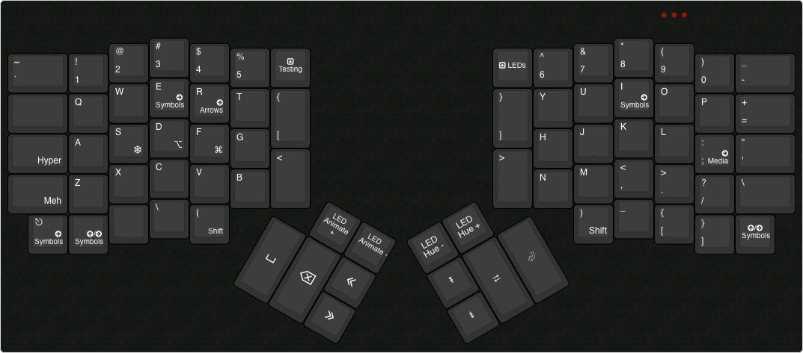

# Layout for BestFriendChris

## Layers

### 0 - Base

QWERTY layout that pretty closely mimics my MacBook Pro keyboard layout.

[Base Layer](http://www.keyboard-layout-editor.com/#/gists/7bf565a1c75d67ac579e3319a4f85f9d)

### 1 - Test

Secondary base layer for experimenting with a new more optimized layout

[Testing Layer](http://www.keyboard-layout-editor.com/#/gists/1d1b5a096518f630fff419b76d802e68)

### 2 - Symbols

Layer that includes most symbols and a numpad

[Symbol Layer](http://www.keyboard-layout-editor.com/#/gists/eb2a540d8bec539307b861821f65c726)

### 3 - Arrows

Layer for navigating with the keyboard

[Arrows Layer](http://www.keyboard-layout-editor.com/#/gists/72bfa8bbef104db85bc7c9c5b77cdbaf)

### 4 - Media & Mouse

Layer for navigating with the Mouse and controling audio

[Media and Mouse Layer](http://www.keyboard-layout-editor.com/#/gists/18370e3ddd672de5fbb2695b9a49702d)

